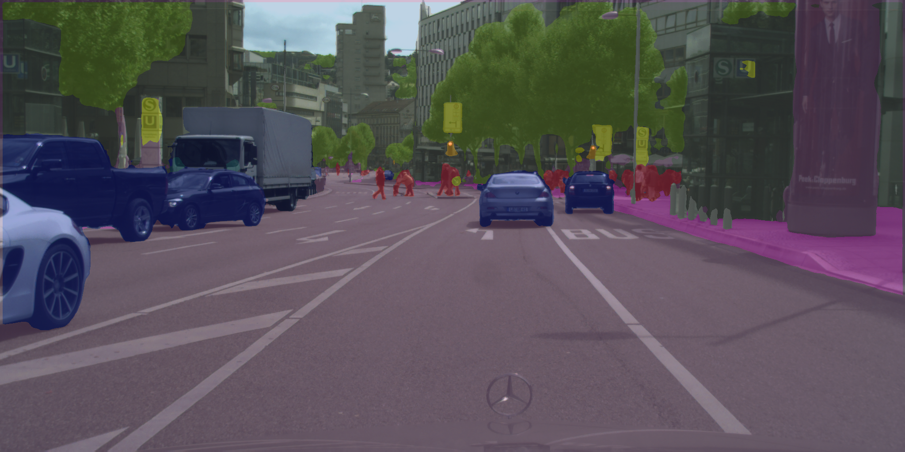

# **Semantic Segmentation on the Cityscapes Dataset**

For a detailed overview of the dataset visit the [Cityscapes website](https://www.cityscapes-dataset.com/) and the [Cityscapes Github repository](https://github.com/mcordts/cityscapesScripts) 

This repository focuses solely on the **Pixel-Level Semantic Labeling Task** of the cityscapes dataset.

&nbsp;

-----
## Script usage

E.g. : Train a `DeepLabV3plus` model named `MyDeepLabV3plus` with `EfficientNetV2B0` backbone, `Dice Loss` as a loss function, using batch size equal to `1`, the `relu` activation function and dropout rate of `0.1` for the Dropout layers, for `60 epochs`.
1. Train the model
    ```
    > python3 train_model.py --data_path /path/to/dataset --model_type DeepLabV3plus --model_name MyDeepLabV3plus --backbone EfficientNetV2B0 --loss DiceLoss --batch_size 1 --activation relu --dropout 0.1 --epochs 60
    ```

2. Evaluate the model on the validation set. 
    - Evaluate the MeanIoU
    - Evaluate the IoU of every class seperatly
    - Generate the confusion matrix for validation set
    ```
    > python3 evaluate_model.py --data_path /path/to/dataset --model_type DeepLabV3plus --model_name MyDeepLabV3plus --backbone EfficientNetV2B0
    ```

3. Create predictions for validation and test set
    
    Perform inference on the validation set and save the predicted images
    ```
    > python3 create_predictions.py --data_path /path/to/dataset --model_type DeepLabV3plus --model_name MyDeepLabV3plus --backbone EfficientNetV2 --split "val"
    ```
    
    Perform inference on the test set and save the predicted images
    ```
    > python3 create_predictions.py --data_path /path/to/dataset --model_type DeepLabV3plus --model_name MyDeepLabV3plus --backbone EfficientNetV2 --split "test"
    ```

    Predictions are saved under the predictions/model-type/model-name/split directory. 
    For the example above the following 4 directories are created: 
    * predictions/DeepLabV3plus/MyDeepLabV3plus/val/rgb
    * predictions/DeepLabV3plus/MyDeepLabV3plus/val/grayscale
    * predictions/DeepLabV3plus/MyDeepLabV3plus/test/rgb
    * predictions/DeepLabV3plus/MyDeepLabV3plus/test/grayscale
    
&nbsp;

The RGB Images look like the following:


&nbsp;

### The `run.sh` performs model **training** and **evaluation** by default, and can optionally make **predictions** on the test set. 
This script invokes the python scirpts and also adds all the logs and predictions of the given model to a zip archive when the predict flag is set.

```
> ./run.sh -d /path/to/dataset -t DeepLabV3plus -n MyDeepLabV3plus -b EfficientNetV2 
```

&nbsp;

------
## Dataset Utilities
### 1. File parsing and decoding
Parse files which are under the following directory sctructure

---
    <data_path> : the root directory of the Cityscapes dataset
    |
    ├── gtFine_trainvaltest
    │   └── gtFine
    │       ├── test
    │       │   ├── berlin
    │       │   ├── bielefeld
    │       │   ├── bonn
    │       │   ├── leverkusen
    │       │   ├── mainz
    │       │   └── munich
    │       ├── train
    │       │   ├── aachen
    │       │   ├── bochum
    │       │   ├── bremen
    │       │   ├── cologne
    │       │   ├── darmstadt
    │       │   ├── dusseldorf
    │       │   ├── erfurt
    │       │   ├── hamburg
    │       │   ├── hanover
    │       │   ├── jena
    │       │   ├── krefeld
    │       │   ├── monchengladbach
    │       │   ├── strasbourg
    │       │   ├── stuttgart
    │       │   ├── tubingen
    │       │   ├── ulm
    │       │   ├── weimar
    │       │   └── zurich
    │       └── val
    │           ├── frankfurt
    │           ├── lindau
    │           └── munster
    └── leftImg8bit_trainvaltest
        └── leftImg8bit
            ├── test
            │   ├── berlin
            │   ├── bielefeld
            │   ├── bonn
            │   ├── leverkusen
            │   ├── mainz
            │   └── munich
            ├── train
            │   ├── aachen
            │   ├── bochum
            │   ├── bremen
            │   ├── cologne
            │   ├── darmstadt
            │   ├── dusseldorf
            │   ├── erfurt
            │   ├── hamburg
            │   ├── hanover
            │   ├── jena
            │   ├── krefeld
            │   ├── monchengladbach
            │   ├── strasbourg
            │   ├── stuttgart
            │   ├── tubingen
            │   ├── ulm
            │   ├── weimar
            │   └── zurich
            └── val
                ├── frankfurt
                ├── lindau
                └── munster

Each of the train,val,test directories contain subdirectories with the name of a city. To use a whole split, *`subfolder='all'`* must be passed to the *`Dataset.create()`* method in order to read the images from all the subfolders. For testing purposes a smaller number of images from the dataset can be used by passing `*subfolder='<CityName>'*`. For example, passing *`split='train'`* to the Dataset() constructor, and *`subfolder='aachen'`* to the *`create()`* method will make the Dataset object only read the 174 images in the folder aachen and convert them into a *tf.data.Dataset*. You can choose either all the subfolders or one of them, but not an arbitrary combination of them. After the images `(x)` and the ground truth images `(y)` are read and decoded, they are combined into a single object `(x, y)`.

&nbsp;

### 2. Preprocessing :
Generally images have a shape of `(batch_size, height, width, channels)`

1. Split the image into smaller patches with spatial resolution `(256, 256)`. Because very image has a spatial resolution of `(1024, 2048)` 32 patches are produced and they comprise a single batch. This means that when the patching technique is used the batch size is fixed to 32. After this operation the images have a shape of `(32, 256, 256, 3)` while the the ground truth images have a shape of `(32, 256, 256, 1)`. To enable patching set the `use_patches` arguement of the `create()` method, to `True`.

&nbsp;

2. Perform data `Augmentation`
   - Randomly perform `horrizontal flipping` of images
   - Randomly adjust `brightness`
   - Randomly adjust `contrast`
   - Apply `gaussian blur` with random kernel size and variance

    &nbsp;

    *NOTE : while all augmentations are performed on the images, only horrizontal flip is performed on the ground truth images, because changing the pixel values of the ground truth images means changing the class they belong to.*
    
&nbsp;

3. Normalize images : 
   - The input pixels values are scaled between **-1** and **1** as default
   - If using a pretrained backbone normalize according to what the pretrained network expects at its input. To determine what type of preprocessing will be done to the images, the name of the pretrained network must be passed as the `preprocessing` arguement of the Dataset constructor. For example, if a model from the EfficientNet model family (i.e EfficientNetB0, EfficientNetB1, etc) is used as a backbone, then `preprocessing = "EfficientNet"` must be passed.

&nbsp;

4. Preprocess ground truth images:
   - Map eval ids to train ids
   - Convert to `one-hot` encoding
   - After this operation ground truth images have a shape of `(batch_size, 1024, 2048, num_classes)`
  
  Finally the dataset which is created is comprised of elements `(image, ground_truth)` with shape `((batch_size, height, width, 3)`, `(batch_size, height, width, num_classes))` 

&nbsp;


------

## **Segmentation Models**

| Models                    | Reference
| ---------------------     | --------------------
| **`U-net`**               | [U-Net: Convolutional Networks for Biomedical Image Segmentation](https://arxiv.org/abs/1505.04597) |
| **`Residual U-net`**      | -
| **`Attention U-net`**     | [Attention U-Net: Learning Where to Look for the Pancreas](https://arxiv.org/abs/1804.03999) , [CBAM: Convolutional Block Attention Module](https://arxiv.org/abs/1807.06521) |
| **`U-net++`**             | [UNet++: A Nested U-Net Architecture for Medical Image Segmentation](https://arxiv.org/abs/1807.10165) |
| **`DeepLabV3+`**          | [Encoder-Decoder with Atrous Separable Convolution for Semantic Image Segmentation](https://arxiv.org/abs/1802.02611) |

Using an ImageNet pretrained backbone is supported only for `U-net`, `Residual U-net` and `DeepLabV3+`.

&nbsp;

## Supported Network families as backbone choices:
| Network Family            |  Reference  |
| -----------               | ----------- |
| **`ResNet`**              | [Deep Residual Learning for Image Recognition](https://arxiv.org/abs/1512.03385) |
| **`ResNetV2`**            | [Identity Mappings in Deep Residual Networks](https://arxiv.org/abs/1603.05027) |
| **`EfficientNet`**        | [EfficientNet: Rethinking Model Scaling for Convolutional Neural Networks](https://arxiv.org/abs/1905.11946) |
| **`EfficientNetV2`**      | [EfficientNetV2: Smaller Models and Faster Training](https://arxiv.org/abs/2104.00298) |
| **`MobileNet`**           | [MobileNets: Efficient Convolutional Neural Networks for Mobile Vision Applications](https://arxiv.org/abs/1704.04861) |
| **`MobileNetV2`**         | [MobileNetV2: Inverted Residuals and Linear Bottlenecks](https://arxiv.org/abs/1801.04381) |
| **`MobileNetV3`**         | [Searching for MobileNetV3](https://arxiv.org/abs/1905.02244) |
| **`RegNetX & RegNetY`**              | [Designing Network Design Spaces](https://arxiv.org/abs/2003.13678) |

&nbsp;

## **Segmentation Losses**
| Loss                          | Description | Reference  |
| -----------                   | ----------- | ----------- |
| **`IoU Loss`**                | Loss based on the IoU (Intersecion over Union) metric | [Generalized Intersection over Union: A Metric and A Loss for Bounding Box Regression](https://arxiv.org/abs/1902.09630) |
| **`Dice Loss`**               | Loss based on the dice or F1 score | [Generalised Dice overlap as a deep learning loss function for highly unbalanced segmentations](https://arxiv.org/abs/1707.03237) |
| **`Tversky Loss`**            | Generalized loss function based on the Tversky index to address the issue of data imbalance | [Tversky loss function for image segmentation using 3D fully convolutional deep networks](https://arxiv.org/abs/1706.05721) |
| **`Focal Tversky`**           | Generalized focal loss function based on the Tversky index | [A Novel Focal Tversky loss function with improved Attention U-Net for lesion segmentation](https://arxiv.org/abs/1810.07842) |
| **`Hybrid Loss`**             | Combines a Region based Loss (Dice) with a Distribution based Loss (Crossentropy) | [Unified Focal loss: Generalising Dice and cross entropy-based losses to handle class imbalanced medical image segmentation](https://www.sciencedirect.com/science/article/pii/S0895611121001750) |
| **`Focal Hybrid Loss`**       | Focal variation of Hybrid Loss | [Unified Focal loss: Generalising Dice and cross entropy-based losses to handle class imbalanced medical image segmentation](https://www.sciencedirect.com/science/article/pii/S0895611121001750) |
